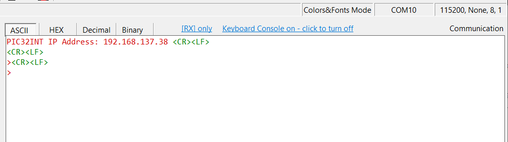
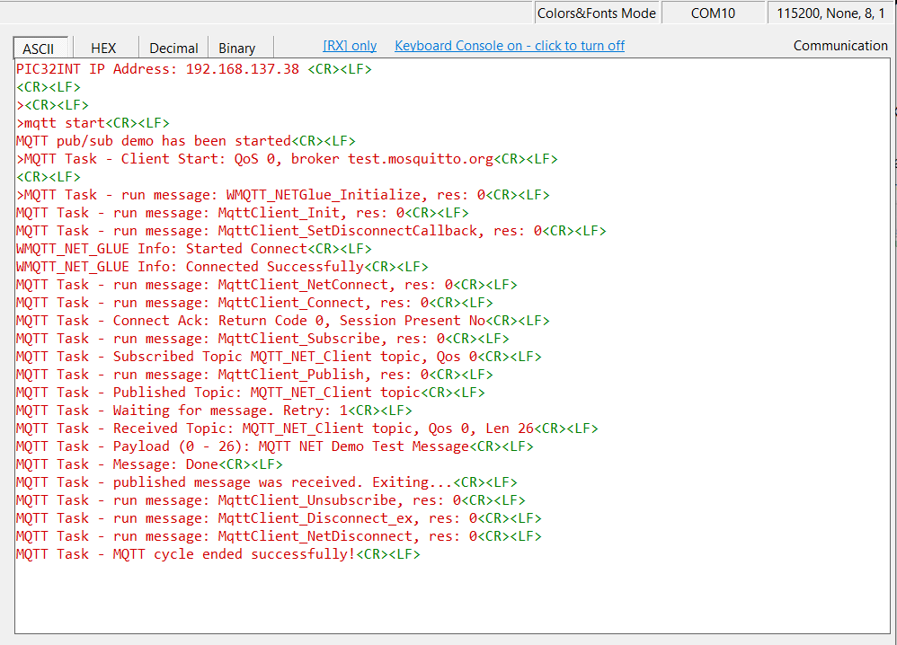
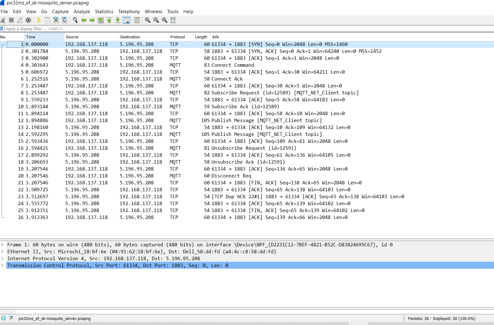
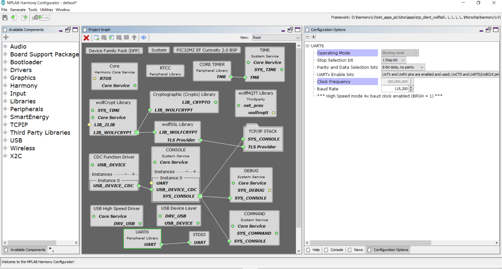

# MQTT_EXAMPLE

Want to develop fundamental understanding on MQTT?
Here's the best example for you to examine how's MQTT looks like.
You must also install wireshark to view sample packet under mqtt_pcap.

### Environment
1. MPLABX IDE v6
2. Harmony V3
3. XC32 v3.0

### Instruction

1. Open pic32mz_curiosity_v2.X with MPLABX IDE
2. Compile build and upload
3. Open USB terminal at baud rate 115200 (or any actually).
4. The board will get the IP address such below,
   
5. Type > mqtt start
6. The board will start to send mqtt req to mosquitto server.
    
7. Output detail can be examined in pcap file under folder mqtt_pcap.
    

## MPLAB Harmony V3 Configuration

